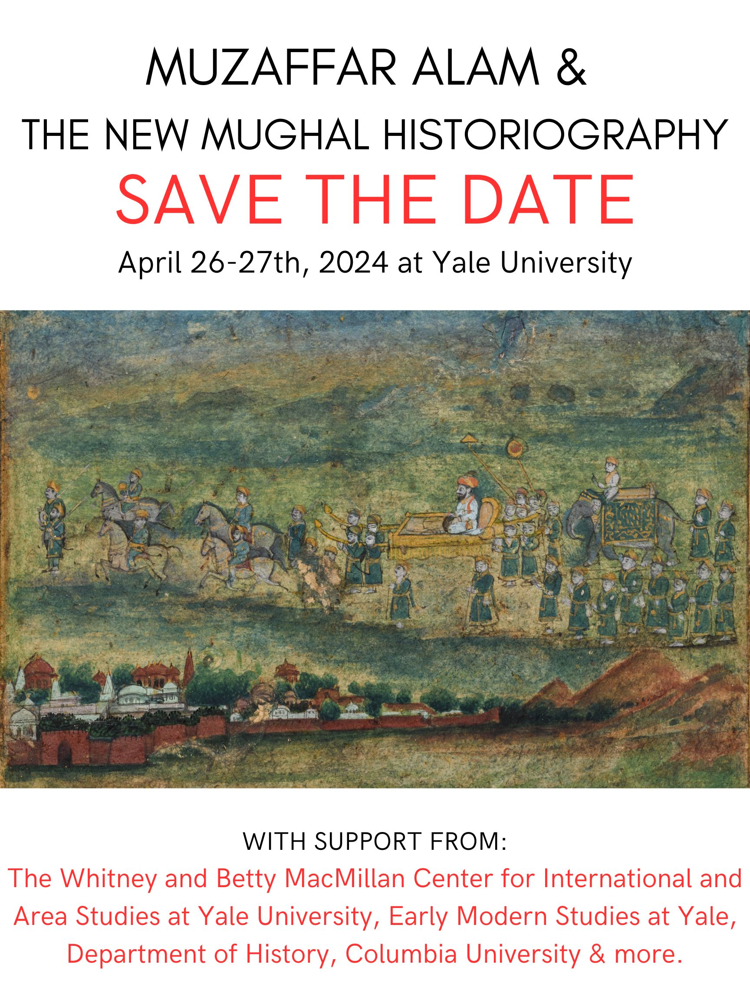

# Muzaffar Alam and the New Mughal Historiography
## April 26th & 27th, 2024
## Yale University

|  |
|:--:|
| *Save the Date* |

## Registration/Attendance
[Link TBD]

## Program

[Forthcoming]

## Organizing Team

- Manan Ahmed
- Jane Mikkelson

## About
We will gather on April 26-27 at Yale for an enriching conversation that brings together scholars of literature, history, religion, culture, and politics in Hindustan ca.1000-2000CE, a millennium marked by multiple major epistemic and political shifts. Much of the recent work on this period has been informed directly (and indirectly) by the scholarship of Muzaffar Alam, George V. Bobrinskoy Professor of South Asian Languages and Civilizations at University of Chicago.

His major monographs--*The Crisis of Empire in Mughal North India* (1986), *The Languages of Political Islam in India: c.1200-1800* (2004), *The Mughals and the Sufis: Islam and Political Imagination in India, 1500–1750* (2021)--offer nuanced critical examinations of political and imperial formation, language and culture, community and belonging, and the making of publics. These major studies have shaped decisive conclusions on the vexed question of the eighteenth century Hindustan and the relationship between religion and political power for the Mughals.

In addition are his collaborations with Sanjay Subrahmanyam (Distinguished Professor & Irving and Jean Stone Endowed Chair in Social Sciences at UCLA), including *The Mughal State 1526-1750* (1998), *Indo-Persian Travels in the Age of Discovery: 1400-1800* (2007) and *Writing the Mughal World: Studies on Culture and Politics* (2011).  Alam and Subrahmanyam have situated Mughal South Asia within broader early modern contexts, revealing routes of contact and entangled histories that extend across Afro-Eurasia. These studies became foundational for the modern framework of connected history.

Since joining the University of Chicago in 2001, Professor Alam has taught and advised multiple generations of specialists in South Asian studies, Persianate studies, and early modern studies. His scholarship and mentorship have helped create new understandings of the Mughal world, sparking new questions that move away from unhelpful narratives of “decline” or “great figures”-focused studies of South Asian pasts. Central to these broad reorientations are matters of language: Persian, and also Sanskrit, Hindavi, Dakkani, Urdu, and others. Alam’s ground-breaking studies have rechannelled attention to new scales and to different kinds of stories. His close engagement with texts in their original languages and contexts reveals how the political, the economic, the cultural, and the social are intertwined and refracted through the lives of bureaucrats and secretaries; at courts and ateliers; in literary imagination and in the lives of texts; in formations of sacral authority across geographies stretching from the Bengal Delta to the Caspian Sea. These are some of the topics and questions that animate the work of the scholars who will gather at this workshop.

This event is a celebration of Muzaffar Alam’s legacy as a scholar and mentor. The participants will be primarily his former students, who will present work that will be collected in an edited volume in his honour. The workshop will consist of short (twenty-minute) presentations, open to the public, spanning two days. Each day there will be two panels comprising three presenters and a respondent. Our event will begin with an opening keynote address by Sanjay Subrahmanyam and will conclude with a closing reflection by Muzaffar Alam.

## Participants

-

## Funding & Support

- [Department of History](http://history.columbia.edu)

## Format

## Venue

## Lodgings

## Dinner

## Visa & Reimbursements
We are happy to provide a letter if you need a visa to travel for the conference. We are happy to reimburse your air or train transportation to the workshop. We will sponsor five nights stay for participants coming from outside US and three night stay for those joining us from within US. Please find below instructions for reimbursements:
* [Guidelines for Travel Reimbursements](http://history.columbia.edu/resources/reimbursement-and-payment-for-non-cu-employees/)
 * All payees must submit a tax form and an expense form in addition to receipts and proof of payment in order to receive reimbursement. Please ensure all of the information on the expense form is legible. If there are questions or problems with the payment, the payee will be contacted via email. Payee should request reimbursement within 10 days of the expense/trip. Please Note: The University observes all INS and IRS regulations regarding payment to nonresident aliens. Certain visa types preclude payment of expenses, professional services, per diem, or salary.
 * Payable foreign nationals must submit a W-8BEN form, copy of passport (visa page and ID page), a Non-Employee Expense form, and receipts.
 * United States Citizens and Permanent Residents: Citizens and Permanent Residents seeking expense reimbursement must submit a W-9 form, a Non-Employee Expense form, and receipts.
* Required forms
  * [W-9](https://www.irs.gov/pub/irs-pdf/fw9.pdf)
  * [W-8BEN](https://www.irs.gov/pub/irs-pdf/fw8ben.pdf)

## Contact
* [Manan Ahmed](mailto:ma3179@columbia.edu) or [Jane Mikkelson](jane.mikkelson@yale.edu) for all matters.

## Event Photos

## Press Coverage
TBD
