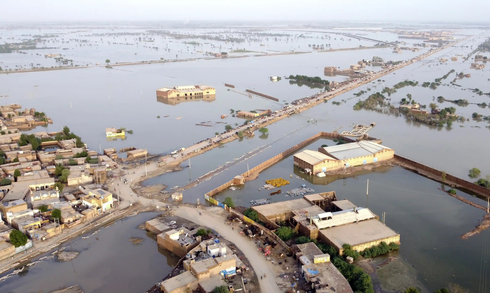
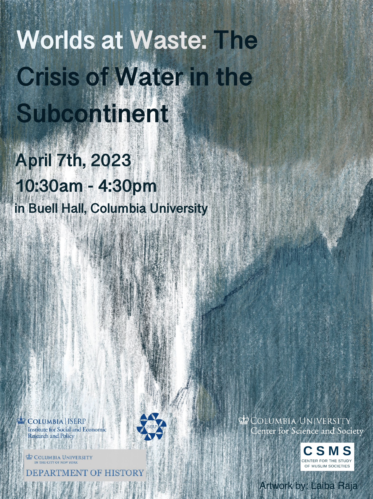

# Worlds at Waste: The Crisis of Water in the Subcontinent
## April 7, 2023
## Columbia University

|  | 
|:--:| 
| *AP Photo/Zahid Hussain* |

## Organizers
- Kavita Sivramakrishnan
- Manan Ahmed
- Kamini Masood

## Prompt: 
The focus of this day-long workshop, “Worlds at Waste: Water,” is to reflect on recent climate events that have caused massive displacement in [southern Pakistan](https://reliefweb.int/report/pakistan/pakistan-2022-monsoon-floods-situation-report-no-12-5-december-2022), [northeastern](https://www.thethirdpole.net/en/climate/stalled-monsoon-behind-devastating-floods-northeast-india-bangladesh/) and [southwestern India](https://nidm.gov.in/PDF/pubs/ChennailFlood_NIDM2021.pdf) and [Bangladesh](https://www.unicef.org/documents/bangladesh-floods-situation-report-27-june-2022). It aims to bring together scientists and social scientists to help look through the lens of historical pasts, politics, and an embedded presents. Devastations and displacement from water caused by climate crists is and will remain a recurring, returning, and pervasive phenomenon in the global south. This approach intends a shift away from the focus on modeling catastrophic futures, the periodization of eras, and mapping the implications of climate change that prevails in current dialogues on climate change. Rather the workshop guides towards a conversation that foregrounds human and environmental vulnerability in non-Western, transnational spaces with indigenous and historical means of resilience. The intention is to continue this series with focus on Air and Land in the following academic year. 

## Participants:

- [Sunil Amrith](https://history.yale.edu/people/sunil-amrith)
- [Amita Baviskar](https://www.ashoka.edu.in/profile/amita-baviskar/)
- [Karine Gagné](https://socioanthro.uoguelph.ca/people/karine-gagn%C3%A9)
- [Maira Hayat](https://keough.nd.edu/people/maira-hayat/)
- [Marvi Mazhar](https://www.marvimazhar.com/)
- [Hung T. T. Nguyen](https://people.climate.columbia.edu/users/profile/tan-thai-hung-nguyen)
- [Andrew Rumbach](https://andrewrumbach.com/)
- [Adam Sobel](https://www.apam.columbia.edu/faculty/adam-sobel)

## Funding & Support
- [Institute for Social and Economic Research and Policy](https://www.iserp.columbia.edu/)
- [Center for Science and Society](https://scienceandsociety.columbia.edu/)
- [Department of History](http://history.columbia.edu)
- [Center for Study of Muslim Societies](http://csms.columbia.edu)

## Format
The workshop consists of four panels and a roundtable. Each panel will be an hour, and will address one key area of expertise from melting glaciers, to floods, to displacement and finally to the rising sea water. Each panel will thus consists of two presenters who will each present for 20 or so minutes on their current, on-going research. Their presentation will be followed by comments from the Chair of the panel. The intent is to put into direct conversation a climate scientist with a social scientist; a climate activist and a policy expert. The participants will share their presentation or deck w/ their co-panelist in advance of the workshop and we expect the panel to reflect that engagement. The final roundtable will be a chance for the audience and the workshop to reflect together. We will seek to publish the presentations as short-essays in an online fora. 

## Schedule: April 7th, 2023

### Welcomes & Coffee (10:00-10:30)

### Melt (10:30-11:30)
- Chair: Manan Ahmed
- Panelists: Karine Gagné & Andrew Rumbach

### Flood (11:45-12:45)
- Chair: Kavita Sivaramakrishnan
- Panelists: Amita Baviskar & Hung T. T. Nguyen

### Displacement (13:45-14:45)
- Chair: Manan Ahmed
- Panelists: Marvi Mazhar & Maira Hayat

### Sea (15:00-16:00)
- Chair: Kavita Sivaramakrishnan
- Adam Sobel & Sunil Amrith

### Concluding Roundtable with all Participants (16:00-16:30)

## Venue:
[Buell Hall, Columbia](https://www.iserp.columbia.edu/sites/default/files/Directions%20to%20Buell%20Hall.pdf)
 
## Lodgings
Midtown

## Dinner
Workshop Dinner- April 7th (18:00) - [Lido Restaurant](https://www.lidodimanhattan.com/) (set menu, wine only)

## Visa & Reimbursements
We are happy to provide a letter if you need a visa to travel for the conference. We are happy to reimburse your air or train transportation to the workshop. We will sponsor three nights stay for participants coming from outside US and 1 night stay for those joining us from within US. Please find below instructions for reimbursements:
* [Guidelines for Travel Reimbursements](http://history.columbia.edu/resources/reimbursement-and-payment-for-non-cu-employees/)
 * All payees must submit a tax form and an expense form in addition to receipts and proof of payment in order to receive reimbursement. Please ensure all of the information on the expense form is legible. If there are questions or problems with the payment, the payee will be contacted via email. Payee should request reimbursement within 10 days of the expense/trip. Please Note: The University observes all INS and IRS regulations regarding payment to nonresident aliens. Certain visa types preclude payment of expenses, professional services, per diem, or salary.
 * Payable foreign nationals must submit a W-8BEN form, copy of passport (visa page and ID page), a Non-Employee Expense form, and receipts.
 * United States Citizens and Permanent Residents: Citizens and Permanent Residents seeking expense reimbursement must submit a W-9 form, a Non-Employee Expense form, and receipts.
* Required forms
  * [W-9](https://www.irs.gov/pub/irs-pdf/fw9.pdf)
  * [W-8BEN](https://www.irs.gov/pub/irs-pdf/fw8ben.pdf)

## Contacts:
* [Kamini Masood](mailto:km3599@columbia.edu) for all matters.
* [Jozef Sulik](mailto:js5055@columbia.edu) for travel reimbursements.

## Event Poster:
|  | 
|:--:| 
| *artist: Laiba Raja* |

## Event Photos:

